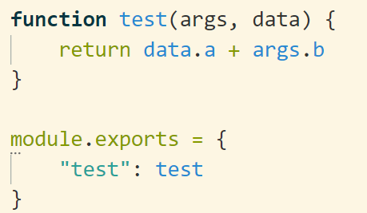

# SBackend

这是一个简单的后端程序，旨在完成大作业等快速迭代项目时提供一个通用的数据后端，避免编写数据库等重复操作。

## 运行

```bash
node main.js
```

## 请求格式

采用url参数的方式接受参数，这样做的好处是可以在浏览器中直接输入，比较方便。请求同时支持GET和POST方法，可以选择任何一个发送。

普通格式：`http(s)://address/?method=<method>&<params>`

base64格式：`http(s)://address/?base=<base64encoded>`

其中，method是必填项，表明需要执行哪个动作，而params是传给method的参数。而base64格式则是把普通格式中从method开始的所有内容编码为base64，放在base字段里面发送。

动作的列表如下：


| 动作 | 参数 | 含义 | 示例 |
| - | - | - | - |
| get | key | 从key的位置中得到一个JSON数据，key是可以用'.'分隔的一串字符 | method=get&key=user.12345 |
| set | key, val | 将key位置的数据替换为val，val是字符串 | method=set&key=data.a&val=hello |
| setj | key, val | 将key位置的数据替换为val，val是JSON数据（也就是对字符串进行一次JSON.parse） | method=setj&key=data.b&val=true |
| all | / | 返回存储的所有数据，JSON格式 | method=all |
| erase | key | 删除key位置的数据 | method=erase&key=data.b |
| save | file | 将当前存储的信息保存到file指定的文件中，file必须是当前目录下的文件，禁止访问其它目录 | method=save&file=a.json |
| load | file | 从当前目录下的file文件读取JSON数据并替换当前的存储信息，禁止访问其他目录的文件 | method=load&file=a.json |
| func | func 和函数自定义参数 | 执行func.js文件中对应的函数，返回函数执行的结果 | method=func&func=test&b=1 |

## 自定义函数

可以通过编写func.js文件达到自定义函数的目的。func.js文件的module.exports是一个object，其中，key为执行函数时使用的名字，而value就是对应的函数，如图。



每个函数接受两个参数：args和data。其中，args代表url中传入的参数列表，而data代表当前存储的所有信息。可以通过该函数实现复杂的功能。
